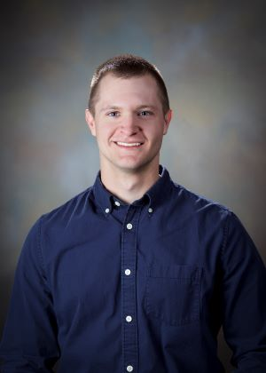

<!--   -->

My name is Daniel Ries and I am a Senior Statistician at Sandia National Laboratories in the Statistical Sciences Group. I received my PhD in statistics from Iowa State University under the direction of Alicia Carriquiry. I am currently pursuing my MBA at the University of New Mexico's Anderson School of Management.

My areas of statistical expertise include measurement error modeling, Bayesian and hierarchical modeling, statistical model calibration and inverse prediction, functional data analysis, deep learning and Bayesian neural networks, and design of experiments. My work at Sandia involves working on multidisciplinary teams with mechancial and electrical engineers, chemists, computer scientists, among others. My work is part basic research, part applied research aimed at development, and part consulting on short and long term projects.

### Contact me

If you would like to contact me, please email me at [ries.daniel1@gmail.com](mailto:ries.daniel1@gmail.com).
